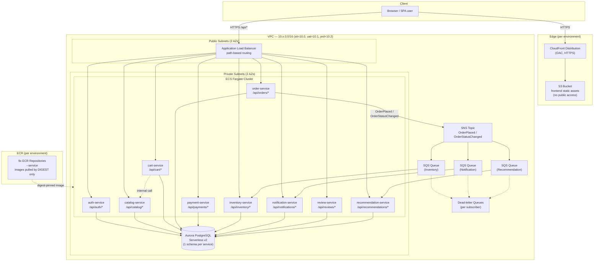
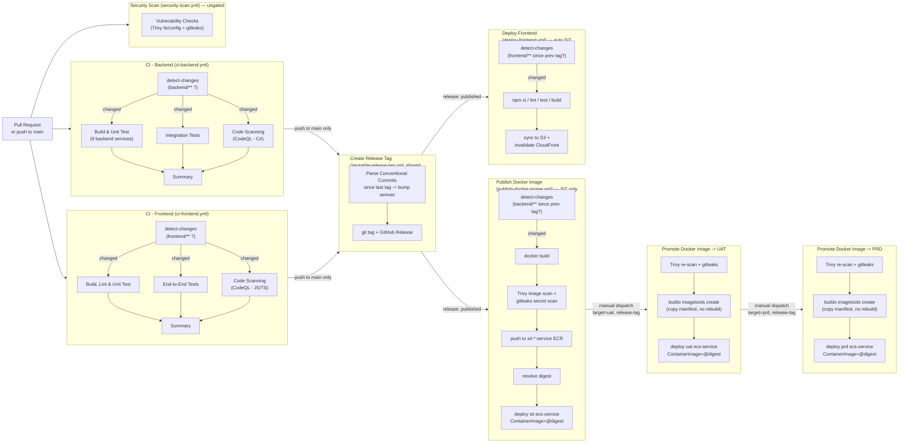

# Architecture Diagram

This diagram is the visual companion to [Section 1 — Architecture Recap](deployment-guide.md#1-architecture-recap)
of the [Deployment & Operations Guide](deployment-guide.md). It reflects exactly what
the CloudFormation templates in `infra/cloudformation/*.yaml` provision, one full stack
per environment (`sit`, `uat`, `prd`).

## High-level infrastructure

## CI/CD pipeline flow

## Notes

- **Single reusable pipeline**: `promote-docker-image.yml` is the same workflow for both
  SIT→UAT and UAT→PRD; the `target-environment` dispatch input selects the source
  environment automatically (`uat` promotes from `sit`, `prd` promotes from `uat`).
- **No rebuilds after Publish**: promotion only ever copies an already-scanned,
  already-published image manifest between ECR repositories — the same bytes that were
  validated in the lower environment are what runs in the next one.
- **Digest-only enforcement**: every `ecs-service` CloudFormation stack update (whether
  from `publish-docker-image.yml` or `promote-docker-image.yml`) sets `ContainerImage`
  to a full `@sha256:<digest>` reference, never a mutable tag, so ECS Fargate always
  pulls the exact, immutable image content that was scanned.
